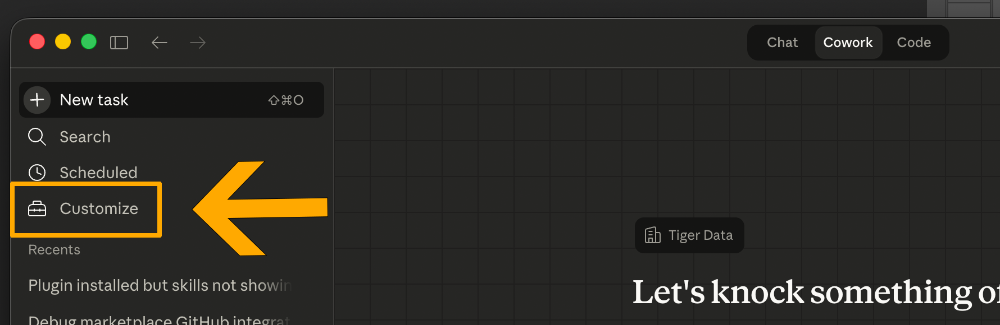
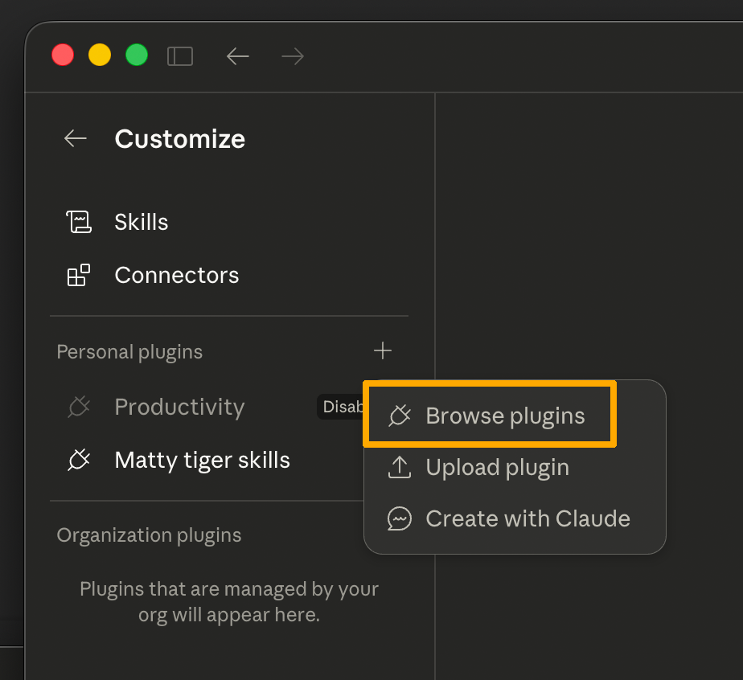
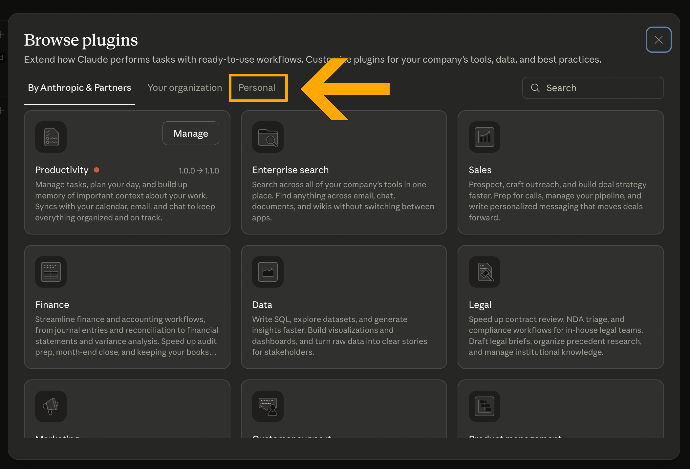
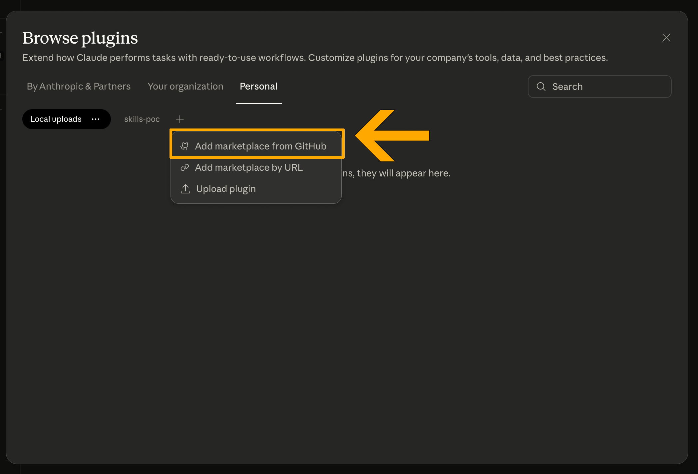
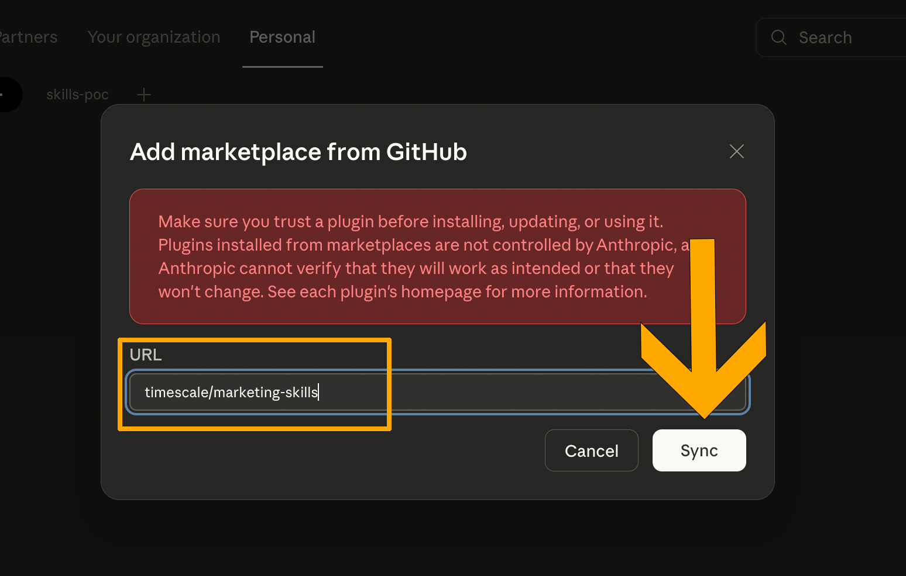
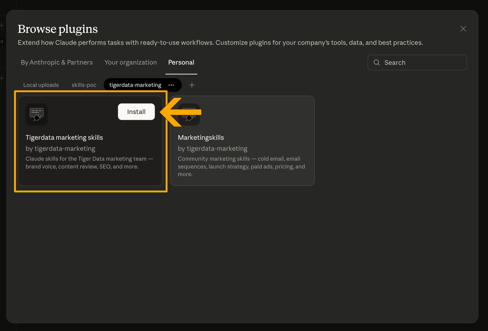
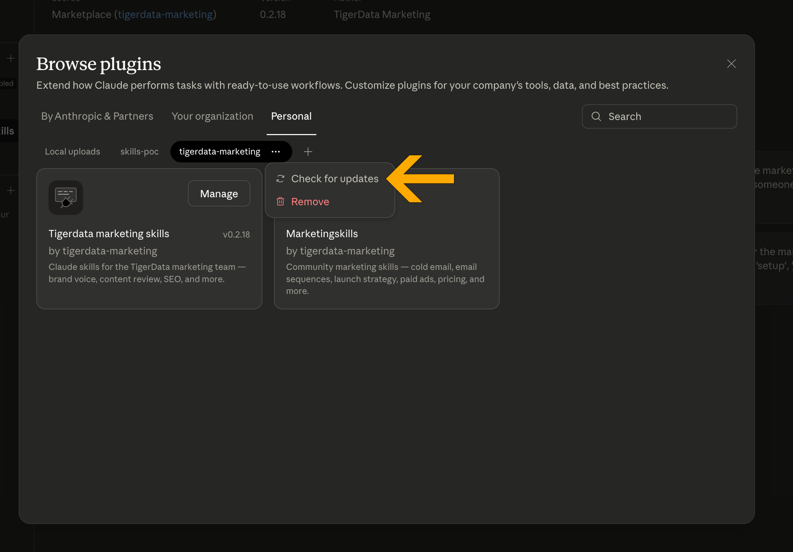
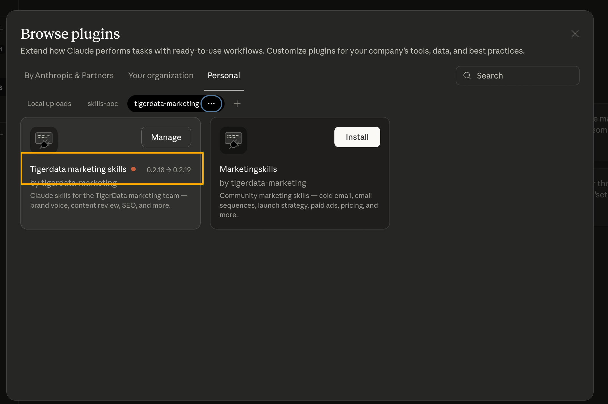
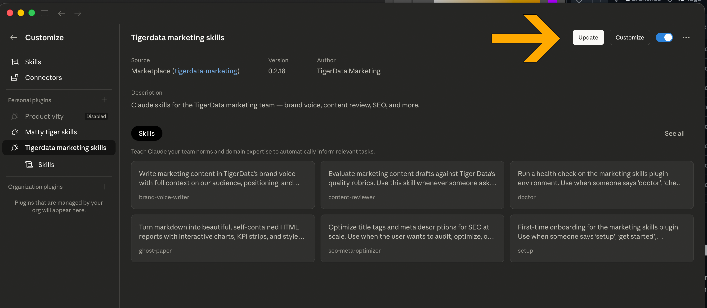

# Install & Update Guide

This guide walks you through installing the Tiger Data marketing skills plugin in **Cowork** (Claude Desktop). It takes about two minutes.

## Install the plugin

### Step 1: Open Customize

In the Cowork tab, click **Customize** in the left sidebar.

### Step 2: Browse plugins

Click the **+** icon and choose **Browse Plugins**.

### Step 3: Switch to the Personal tab

On the Browse page, click **Personal**.

### Step 4: Add the marketplace

Click the **+** icon and select **Add marketplace from GitHub**.

### Step 5: Sync the marketplace

Paste `timescale/marketing-skills` in the URL field, then click **Sync**.

### Step 6: Install

You'll see the plugins from our marketplace. Click **Tiger Data Marketing Skills** and hit **Install**.

You may also see community plugins (like marketing skills by Corey Haines) — feel free to install those too if they look useful.

### Done!

The plugin is ready to use. Start a new Cowork session and try it out.

## Update the plugin

New versions should auto-update within 24 hours. If you want to update sooner, here's how.

### Step 1: Open Browse Plugins

Go to the Browse Plugins page (same as during install).

### Step 2: Check for updates

Under **Personal**, find the **tigerdata-marketing** marketplace. Click the **…** menu and select **Check for updates**.

### Step 3: Update

If an update is available, you'll see it listed. Click **Manage** to go to the update page.

Click **Update** and you're done.

---

## Manual install (fallback)

If the marketplace method isn't working, you can install from a `.zip` file instead.

1. Go to the [latest release](https://github.com/timescale/marketing-skills/releases/latest) and download the `.zip` file
2. In Cowork, go to **Customize** → **Browse Plugins** → **Personal** → click **+** → **Upload plugin**
3. Select the `.zip` file

To update manually, download the latest `.zip` from the releases page and upload it again. Start a **new session** after updating — skills only refresh in new sessions.
